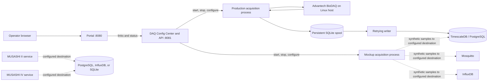

# IIoT-data-ingestion

IIoT-data-ingestion is the umbrella name for the industrial data ingestion services in this repository. The current Docker Compose stack runs DAQ Navi, its Config Center, a Portal, and shared infrastructure. MUSASHI II and MUSASHI IV are included as separate services but are not started by this Compose file.

## Deploy on Linux

### 1. Prepare the host and configuration

Use a Linux host with Docker Engine and the Docker Compose plugin. Physical DAQ acquisition also needs a supported Advantech DAQNavi/BioDAQ driver, SDK, and device installed on that host. The DAQ container mounts host device files and vendor libraries; Windows deployment is unsupported.

```bash
cp .env.example .env
# Edit .env: replace the example database and InfluxDB passwords and tokens.
```

Review [the saved DAQ configuration](services/daq_navi/config.json) or open the Config Center before collecting data. Its checked-in device, channel, calibration, and destination values are machine-specific examples. Keep database credentials in the saved DAQ configuration consistent with those in `.env`. The service may begin acquisition when it starts if `AUTO_START_ON_STARTUP` is enabled.

If the TimescaleDB volume already exists, changing `POSTGRES_PASSWORD` in `.env` alone does not change the password of the existing database user. Update that user in PostgreSQL and the DAQ destination configuration together.

### 2. Start the stack

The default command loads both `docker-compose.yml` and `docker-compose.override.yml`. The override bind-mounts the DAQ source for development. Restart `daq-navi` if a Python or template change is not visible.

```bash
docker compose up -d --build
docker compose ps
curl http://localhost:8081/api/health
```

To use only the base Compose file, without the development override:

```bash
docker compose -f docker-compose.yml up -d --build
```

Open the Portal at `http://<linux-host>:8080` and the DAQ Config Center at `http://<linux-host>:8081`. The DAQ REST API uses port 8081 as well.

| Compose service | Default host port | Role |
|:---|---:|:---|
| `portal` | 8080 | Service links and browser-side status polling. |
| `daq-navi` | 8081 | DAQ Config Center, API, and acquisition control. |
| `timescaledb` | 5432 | PostgreSQL/TimescaleDB destination. |
| `mqtt-broker` | 1883 | Mosquitto for configured MQTT paths. |
| `influxdb` | 8086 | InfluxDB for configured InfluxDB paths. |

The Portal also links to MUSASHI II on port 8082 and MUSASHI IV on port 8083. Those services need separate deployment; they will not appear in `docker compose ps`. Host ports can be changed with `PORTAL_PORT`, `DAQ_PORT`, `DB_PORT`, `MQTT_PORT`, and `INFLUX_PORT`.

### 3. Start acquisition and check delivery

For physical acquisition, confirm the DAQ card is visible on the Linux host. In the Config Center, scan for the device, check wiring and channel settings, test the destination connection, save, then start **production** acquisition. If saved auto-start is enabled, check the running mode before making changes. A successful connection test checks connectivity only.

```bash
curl http://localhost:8081/api/status
curl 'http://localhost:8081/api/samples?channel=0'
docker compose logs -f daq-navi
```

Use an enabled channel number in the sample URL. In the status response, inspect `status`, `healthy`, `writer_error`, `pending_batches`, and `last_sample_ns`. A queue can grow briefly while the writer catches up; a persistent increase needs investigation. Confirm that recent samples reach the intended table. An API health response alone does not establish end-to-end delivery.

The web interfaces have no built-in authentication. Limit access to a trusted network or add access control before wider exposure. [Linux deployment](DEPLOY_LINUX.md) describes host mounts, port exposure, lifecycle commands, and optional setup helpers. `docker compose down` preserves named database and spool volumes; `docker compose down -v` deletes them.

## Architecture

### Service boundaries



| Component | Responsibility | Location |
|:---|:---|:---|
| Portal | Static service directory. It links to consoles and polls their status; it does not ingest telemetry. | `services/portal/`, Nginx container |
| DAQ Config Center and API | Save and validate configuration, scan devices, test destinations, control acquisition, and report status. | `services/daq_navi/web/`, `daq-navi` container |
| DAQ acquisition | Physical capture or synthetic mockup generation, launched as a child process by the DAQ web service. | `services/daq_navi/core/` |
| TimescaleDB | Production DAQ sample and gap storage, plus legacy/bootstrap tables. | `timescaledb` container, `tsdb_data` volume |
| Mosquitto and InfluxDB | Available destinations for configured paths. Starting them does not publish production DAQ samples to them. | `mqtt-broker` and `influxdb` containers |
| MUSASHI II | Polls a dispenser over serial/RS-232C and writes via its configured PostgreSQL, InfluxDB, or SQLite handler. | `services/musashi_ii/`; separate runtime |
| MUSASHI IV | Polls a dispenser HTTP API and writes via its configured PostgreSQL, InfluxDB, or SQLite destination; supports mock API data. | `services/musashi_iv/`; separate runtime |

The MUSASHI services have their own configuration and process controls. Their Portal links do not start them or connect them to the DAQ pipeline.

### DAQ control and configuration

The DAQ web service reads and writes [`services/daq_navi/config.json`](services/daq_navi/config.json). The Config Center exposes the hardware span, sensor channel table, per-channel calibration, destination, startup behavior, and runtime status. The API merges and validates changes before saving. Production start validates the saved configuration again. Saving during acquisition can stop and restart the run after confirmation in the UI.

`START_CHANNEL` and `CHANNEL_COUNT` select a contiguous hardware input span. `CHANNELS` contains each input's enabled state, label, unit, signal type, voltage range, and linear calibration. For PCI-1716 differential inputs, an even channel starts a pair and reserves the following odd channel. The physical wiring, input mode, and range must agree.

| Setting | Meaning |
|:---|:---|
| `DEVICE_DESCRIPTION`, `DEVICE_ID`, `PROFILE_PATH` | Driver device selection, stored device identifier, and optional DAQNavi profile. |
| `START_CHANNEL`, `CHANNEL_COUNT`, `CHANNELS` | Hardware span and sensor settings. |
| `CLOCK_RATE`, `SECTION_LENGTH`, `SECTION_COUNT` | Samples per second per channel, samples per channel per read section, and section count. Continuous production capture requires `SECTION_COUNT=0`. |
| `DESTINATION`, `DB_*`, `INFLUX_*`, `MQTT_*` | Destination and connection settings. Production mode requires PostgreSQL/TimescaleDB. |
| `SPOOL_DIR`, `SPOOL_MAX_BYTES` | Persistent production queue and its configured byte limit. |
| `AUTO_START_ON_STARTUP`, `AUTO_START_MODE` | Whether service startup begins acquisition and which mode to use. |

Compose `.env` configures container startup, published ports, and infrastructure credentials. The saved DAQ JSON remains authoritative for DAQ acquisition settings after initial setup; changing `.env` does not rewrite saved destination or channel settings. See the [Config Center workflow](services/daq_navi/web/README.md) for channel editing and calibration.

### Production data path

1. The acquisition process opens the configured Advantech device through BioDAQ and reads waveform sections from the selected input span.
2. It timestamps enabled channel samples, retains raw voltage, and applies each channel's calibration to produce an engineering-unit value.
3. It compresses each batch and commits it to a persistent SQLite spool in the `daq_spool` volume. A committed batch is the local recovery boundary.
4. A writer sends pending batches to PostgreSQL/TimescaleDB, acknowledges them after successful writes, and retries unacknowledged batches. Stable sample IDs make replay idempotent.
5. Interruptions are recorded in `daq_production_gaps`. The production table, normally `daq_production_samples`, stores raw and calibrated values, channel and sensor metadata, session ID, and provenance. A retention policy applies to this hypertable.

The spool limit bounds bytes, not outage duration. A process crash can lose a hardware section that has not yet been committed to the spool. The production writer does not publish those samples to MQTT or InfluxDB. See [production records](docs/architecture/erd.md), [data flow](docs/architecture/data-flow.md), and [acquisition sequence](docs/architecture/sequences/streaming_pipeline.md).

### Mockup and other storage paths

DAQ mockup acquisition generates synthetic values and uses its configured destination. Its PostgreSQL table is configured separately from the production table through `DB_MOCKUP_TABLE` and `DB_PRODUCTION_TABLE`. The older `daq_telemetry` table created by [`scripts/sql/db_setup.sql`](scripts/sql/db_setup.sql) is separate from production samples; reading it does not verify physical ingestion. MUSASHI II and IV use their own configuration files and storage schemas.

### Repository map

| Path | Contents |
|:---|:---|
| `docker-compose.yml`, `docker-compose.override.yml` | Base stack and development bind mounts. |
| `services/portal/` | Static Portal frontend. |
| `references/advantech_sdk/`, `docs/hardware/` | Vendor examples and hardware references; see the [third-party provenance inventory](docs/third-party-provenance.md) for notices and redistribution status. |
| `services/daq_navi/web/` | Config Center, REST API, and process control. |
| `services/daq_navi/core/` | DAQ configuration loading, physical capture, spool, writer, and mockup acquisition. |
| `services/musashi_ii/`, `services/musashi_iv/` | Independent dispenser ingestion services. |
| `shared/`, `config/` | Shared code and Mosquitto configuration. |
| `scripts/sql/` | Legacy/bootstrap database schema. |
| `deploy/linux/`, `scripts/setup_wizard.sh` | Optional Linux host setup helpers. |
| `CONTEXT.md`, `docs/adr/`, `docs/architecture/` | Domain language, decisions, and detailed diagrams. |
| `docs/hardware/` | Hardware specifications and wiring references, including [PCI-1716](docs/hardware/PCI-1716.md). |

## DAQ API and further reading

| Endpoint | Method | Use |
|:---|:---:|:---|
| `/api/health`, `/api/status` | GET | Health, mode, fault, queue, and recent gap state. |
| `/api/config` | GET/POST | Read or save validated DAQ configuration. |
| `/api/scan_usb` | GET | Discover DAQ devices visible to the service. |
| `/api/test_destination` | POST | Test destination connectivity; `/api/test_db` is an alias. |
| `/api/start`, `/api/stop` | POST | Control acquisition. |
| `/api/samples?channel=N` | GET | Query recent production samples for a channel. |
| `/api/retention` | GET | Inspect the production retention policy. |

Read [Linux deployment](DEPLOY_LINUX.md) for operations, [DAQ Config Center](services/daq_navi/web/README.md) for configuration, [domain glossary](CONTEXT.md) for acquisition terms, and [DAQ check guidance](services/daq_navi/tests/README.md) before running checks that need hardware or a database.
