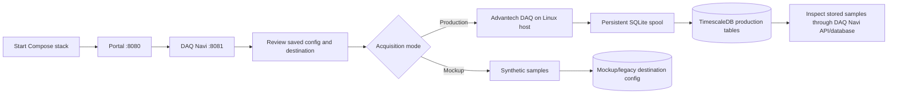
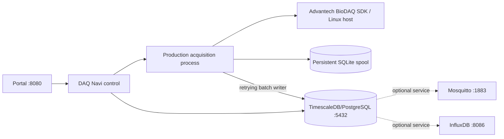

# MDDP Ingestion Control Suite

A Linux-only Docker Compose workspace for configuring Advantech DAQNavi acquisition, storing time-series data, and viewing service status. Linux is required because the DAQ container mounts host device files and Advantech libraries. Physical acquisition requires the supported Linux host driver and DAQ hardware. Windows deployment is not supported. Mockup acquisition is available for demonstrations and development on Linux.

- **Portal** (`:8080`): links to the service interfaces.
- **DAQ Navi** (`:8081`): acquisition configuration, start/stop controls, status, and sample inspection.
- **TimescaleDB**, **Mosquitto**, and **InfluxDB** provide database/broker services in the Compose stack.

---

## 1. System Architecture & Operation Principles

### A. User Operation Flow



Production capture writes batches to the persistent local spool before the database writer sends them to TimescaleDB. Failed writes remain pending for retry, subject to the configured spool limit. Mockup acquisition is a separate mode; verify its configured destination and table before using it.

### B. Technical Architecture Diagram



The Compose stack also starts MQTT and InfluxDB; their presence does not mean the production DAQNavi pipeline publishes to them. The production destination currently uses PostgreSQL/TimescaleDB.

---

## 2. Production Acquisition Features

- **Configured channel acquisition** using Advantech `WaveformAiCtrl`; channel count, signal type, range, clock rate, and section settings come from the saved DAQNavi configuration.
- **Raw and calibrated values** are recorded with channel, device, session, unit, and calibration metadata.
- **Persistent buffering** stores compressed batches in a SQLite spool volume before database delivery. The configured byte limit bounds spool use; it does not guarantee a fixed number of hours because that depends on channel count, rate, payload, and available disk.
- **Retryable, idempotent writes** keep unacknowledged batches on database failure and use a stable sample key to avoid duplicate rows on replay.
- **Gap records** make production interruptions explicit in `daq_production_gaps`.
- **Retention policy** is managed for the production hypertable and can be inspected in the DAQ interface/API.
- **Mockup mode** is intended for synthetic demonstration/testing. It is distinct from production acquisition; check the saved destination/table configuration before starting it.

Production tables are created/managed by the production destination code. The legacy `scripts/sql/db_setup.sql` schema is not a compatibility view over production data; do not assume `daq_telemetry` contains production samples.

---

## 3. Quick Start & Deployment

### Docker Compose

```bash
cp .env.example .env
# Edit .env and replace demo credentials/tokens before exposing services.
docker compose up -d
```

The default `docker-compose.override.yml` enables development mounts/settings. To run only the base Compose configuration:

```bash
docker compose -f docker-compose.yml up -d
```

Check services and DAQ API health:

```bash
docker compose ps
curl http://localhost:8081/api/health
```

Open Portal at `http://localhost:8080` and DAQ Navi at `http://localhost:8081`. See [Linux deployment](DEPLOY_LINUX.md) for the required host setup and operations. This stack must be deployed on Linux; Windows is unsupported.

---

## 4. Configuration Reference

The saved DAQNavi configuration is [`services/daq_navi/config.json`](services/daq_navi/config.json). It is machine-specific; treat the deployed file and DAQ UI as authoritative rather than assuming the checked-in values suit your device.

| Setting | Purpose |
|:---|:---|
| `DEVICE_DESCRIPTION` | Advantech device identifier used by the driver. |
| `START_CHANNEL`, `CHANNEL_COUNT` | Hardware channel span selected for acquisition. |
| `CLOCK_RATE` | Sampling frequency requested from the DAQ. |
| `SECTION_LENGTH`, `SECTION_COUNT` | Acquisition buffer section size and section-count behavior. |
| `CHANNELS` | Per-channel enablement, label, unit, signal type, input range, and optional calibration scale. |
| `DESTINATION` | Selected output destination; production validation requires PostgreSQL. |
| `DB_PRODUCTION_TABLE`, `DB_MOCKUP_TABLE` | Table names used by the corresponding configured paths. |
| `DB_RETENTION_DAYS` | Production raw-data retention window requested from TimescaleDB. |
| `SPOOL_DIR`, `SPOOL_MAX_BYTES` | Persistent local queue location and maximum configured size. |
| `MOCKUP_MODE`, `AUTO_START_ON_STARTUP` | Mockup selection and whether saved configuration requests startup acquisition. |

Do not copy a channel calibration example without checking the sensor wiring, signal type, voltage range, and engineering-unit conversion. See the DAQ configuration UI and [CONTEXT.md](CONTEXT.md) for terminology.

---

## 5. Web Control & REST API

DAQ Navi is served on port `8081`.

| Endpoint | Method | Description |
|:---|:---:|:---|
| `/api/health` | GET | Service health response. |
| `/api/status` | GET | Acquisition process and spool/status information. |
| `/api/config` | GET/POST | Read or update saved configuration (validated by the service). |
| `/api/retention` | GET | Inspect the active production retention policy. |
| `/api/test_destination` | POST | Test the configured destination connection (`/api/test_db` is an alias). |
| `/api/scan_usb` | GET | Scan for DAQ devices visible to the running service. |
| `/api/start` | POST | Start acquisition using the requested mode and saved configuration. |
| `/api/stop` | POST | Stop the active acquisition process. |
| `/api/samples?channel=N` | GET | Read recent samples for a channel. |

See [`services/daq_navi/web/app.py`](services/daq_navi/web/app.py) for request and response details. A successful connection test confirms destination connectivity; it does not prove that the hardware, wiring, calibration, or full ingestion pipeline is correct.

---

## 6. Testing & Quality Verification

The DAQNavi tests include mocked unit/API coverage and separate qualification scripts that can interact with a database. Read [`services/daq_navi/tests/README.md`](services/daq_navi/tests/README.md) before running them, especially the database safety requirements. Run only the test commands documented there with an isolated test database; do not point qualification tests at a live acquisition database.
