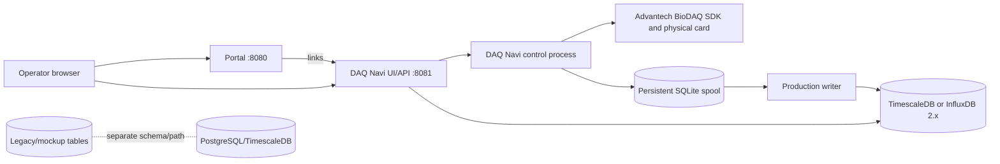

# System Context

Production acquisition requires the supported Linux host's DAQNavi driver and device. The persistent spool buffers batches for destination delivery (PostgreSQL/TimescaleDB or InfluxDB 2.x). Legacy/mockup tables are not a projection of the production hypertable unless the database is separately configured to provide one. MQTT is an included broker for mockup paths; production acquisition does not publish to MQTT.
