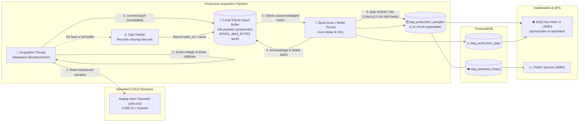

# Data Flow Diagram

**What this shows**:
1. **Acquisition**: Physical analog signals from channels 0–3 are captured at 2,000 Hz per channel. Raw voltage and calibrated values are calculated per sample.
2. **Buffering & Persistence**: Batches are committed immediately into a persistent SQLite spool file (`production-spool.sqlite3`) compressed with zlib. If TimescaleDB is down, capture continues uninterrupted for at least 24 hours.
3. **Replay & Idempotence**: The background writer thread reads unacknowledged batches from the spool and flushes them into `daq_production_samples` using `ON CONFLICT (time, sample_id) DO NOTHING`. Upon successful database commit, the batch is pruned from the spool.
4. **Gap Tracking**: Deliberate stops, driver errors, or buffer overflows create entries in `daq_production_gaps` to ensure gaps are rendered as blank intervals on charts.
5. **Consumption**: Web API (`/api/samples`) and Plotter query the hypertable and compatibility view `daq_telemetry`.
