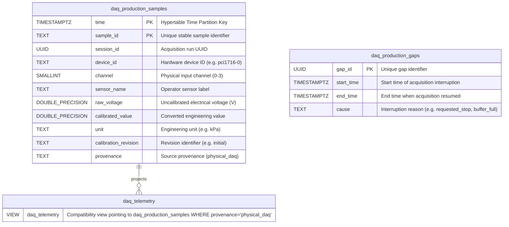

# Entity Relationship Diagram (ERD)

**What this shows**:
- **`daq_production_samples`**: TimescaleDB hypertable partitioned by `time` with 1-hour chunks, holding validated physical sensor measurements with full calibration metadata, dual voltage/calibrated storage, and idempotent `(time, sample_id)` primary key.
- **`daq_production_gaps`**: Tracks missing-data intervals and fault causes (`buffer_full`, `requested_stop`, process crash) so dashboards display real acquisition gaps rather than interpolated data.
- **`daq_telemetry`**: A compatibility view exposing `daq_production_samples WHERE provenance = 'physical_daq'` to support legacy dashboard queries while ensuring 100% untraceable legacy and mockup rows are excluded.
