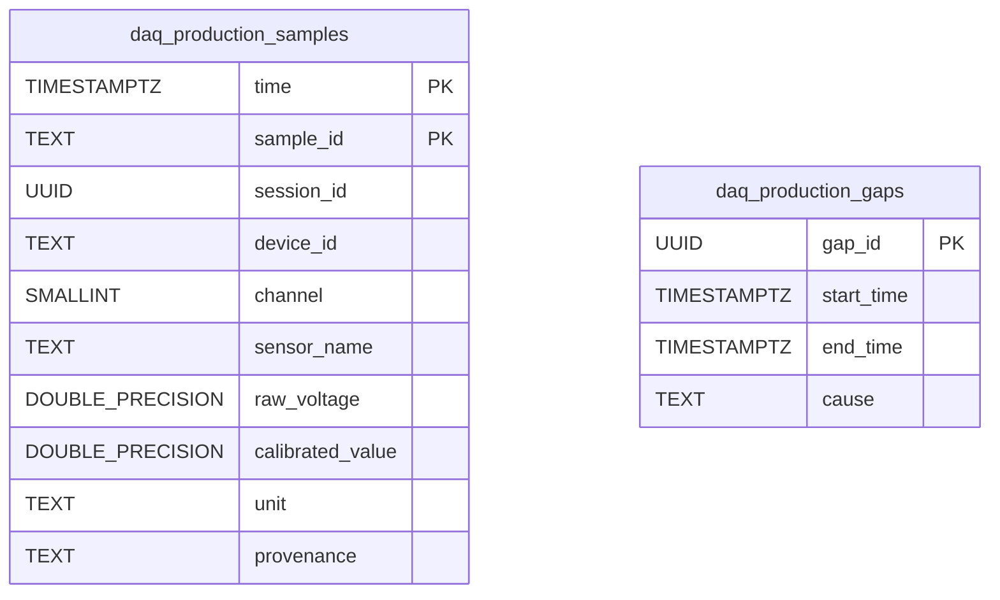

# Production Storage Records

The production destination manages the production sample records and acquisition-gap records at runtime.

### PostgreSQL / TimescaleDB Schema

The relational schema uses a TimescaleDB hypertable for `daq_production_samples` (partitioned on `time`) and a regular table for `daq_production_gaps`. The stable sample identity (`sample_id`) supports idempotent retries. The legacy schema initialized by `scripts/sql/db_setup.sql` includes separate tables such as `daq_telemetry`; it is not a view over `daq_production_samples`.

### InfluxDB 2.x Line Protocol Schema

When InfluxDB is selected as the production destination, data points are written at nanosecond precision (`precision=ns`):

- **Samples Measurement** (`INFLUX_MEASUREMENT`, default `daq_telemetry` or configured measurement):
  - **Tags**: `device_id`, `channel`, `session_id`, `unit`, `provenance`
  - **Fields**: `sample_id` (string; kept as field to avoid high tag cardinality), `raw_voltage` (float), `calibrated_value` (float)
  - **Timestamp**: Nanosecond Unix timestamp (`time_ns`)
- **Gaps Measurement** (`daq_acquisition_gaps`):
  - **Tags**: `gap_id` (stable identifier)
  - **Fields**: `start_ns` (integer), `end_ns` (optional integer), `open` (boolean), `cause` (string)
  - **Timestamp**: Gap start timestamp in nanoseconds
