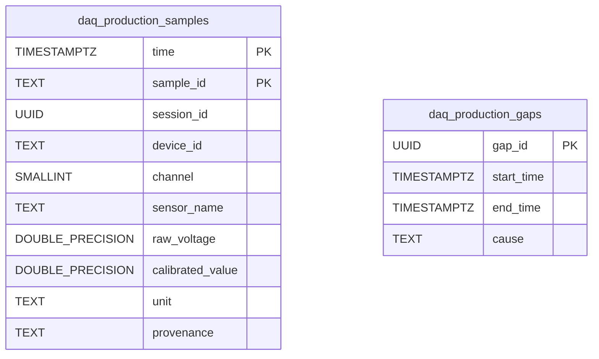

# Production Storage Records

The production destination manages the production sample hypertable and acquisition-gap records at runtime. The stable sample identity supports idempotent retries. The legacy schema initialized by `scripts/sql/db_setup.sql` includes separate tables such as `daq_telemetry`; it is not a view over `daq_production_samples` by virtue of this diagram. Consult the production destination implementation for the deployed schema details.
