# Streaming Pipeline Sequence Diagram

```mermaid
sequenceDiagram
    autonumber
    actor Operator
    participant WebUI as DAQ Web UI (:8081)
    participant Pipeline as Production Pipeline
    participant HW as Advantech DAQ (PCI-1716)
    participant Spool as Local SQLite Spool
    participant DB as TimescaleDB

    Operator->>+WebUI: POST /api/start {"mode": "production"}
    WebUI->>+Pipeline: Fork & initialize ProductionPipeline
    Pipeline->>+HW: WaveformAiCtrl.prepare() & start()
    Pipeline->>Spool: Initialize schema & recover pending batches

    rect rgb(30, 40, 50)
        Note right of Pipeline: Acquisition Loop (every batch)
        Pipeline->>+HW: getDataF64(USER_BUFFER_SIZE, timeout=1000ms)
        HW-->>-Pipeline: raw interleaved double array
        Note over Pipeline: Compute monotonic timestamps & calibrate per channel
        Pipeline->>+Spool: append(batch_id, zlib_compressed_rows)
        Spool-->>-Pipeline: commit OK
    end

    rect rgb(40, 30, 50)
        Note left of Pipeline: Storage & Replay Loop (async worker)
        Pipeline->>+Spool: oldest()
        Spool-->>-Pipeline: (batch_id, rows, gaps)
        Pipeline->>+DB: INSERT INTO daq_production_samples ON CONFLICT DO NOTHING
        DB-->>-Pipeline: 200 OK / Error
        alt Database Success
            Pipeline->>+Spool: acknowledge(batch_id)
            Spool-->>-Pipeline: delete OK
        else Database Error / Outage
            Note over Pipeline: Keep batch in spool & retry with backoff
            Note over WebUI: /api/status reports 'buffering'
        end
    end

    rect rgb(50, 40, 30)
        Note right of Operator: Live Monitoring
        WebUI->>+DB: SELECT * FROM daq_production_samples WHERE channel=0 LIMIT 500
        DB-->>-WebUI: points (raw_voltage, calibrated_value, unit, revision)
        WebUI->>+Spool: SELECT * FROM gaps
        Spool-->>-WebUI: gap intervals
        WebUI-->>Operator: Render chart with trace breaking on gaps
    end
```

**What this shows**:
1. When started, the pipeline captures hardware data, stamps monotonic timestamps anchored to local system time, and commits batches to local SQLite spool first.
2. The asynchronous writer flushes batches into TimescaleDB with idempotence (`ON CONFLICT DO NOTHING`).
3. Outages cause the pipeline to buffer locally while the Web UI reports `buffering`. Once the database recovers, backlogged batches drain automatically in commit order.
4. Gaps are retrieved alongside telemetry to render truthful discontinuous graphs on operator dashboards.
