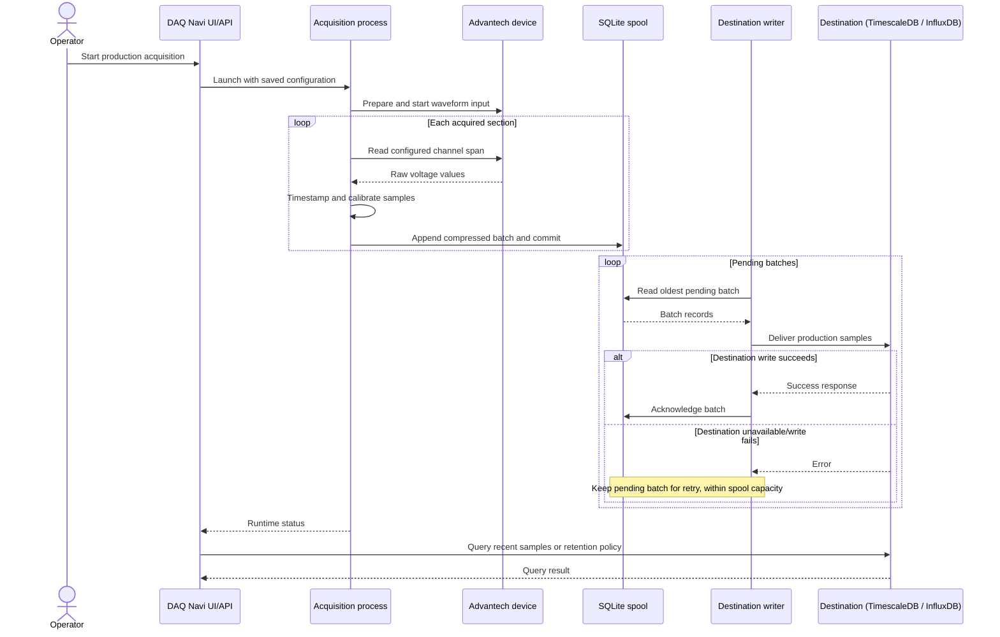

# Production Acquisition Sequence

The exact start and stop behavior depends on the saved configuration and process state. Acquisition gaps are persisted separately; status and sample APIs expose runtime/database information but are not a substitute for checking that expected rows are arriving at the destination.
